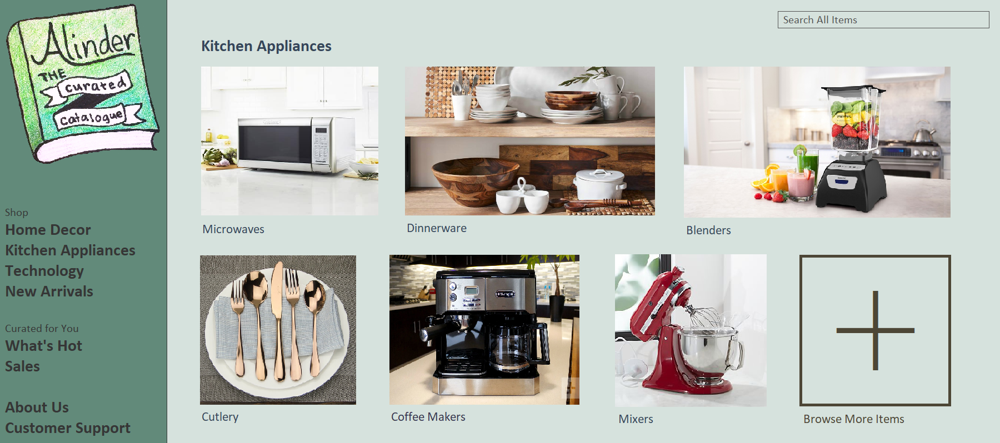
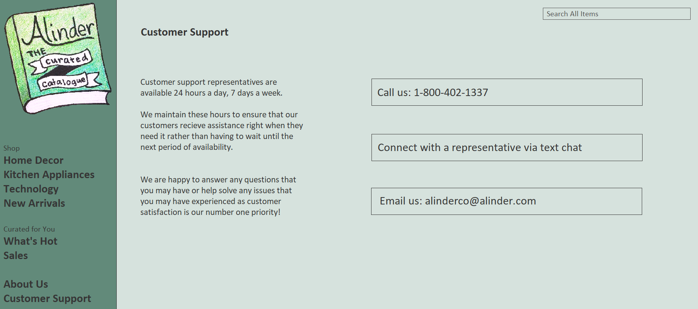

# T4

## Task 1: Team Leader
Michelle Julsen

## Task 2: Business Partners

As an online marketplace, the largest segment of our buisness partners will be suppliers. As one key component of our site for the time being is technology, suppliers who specialize here will be neccessary. Technology is an industry that tends to skip the middleman and go straight from manufacturer/designer to seller, so there are no real large scale suppliers. Therefore relationships will need to be made with with companies such as Sony, Apple, Samsung, and Google as well as smaller distributors. For other merchandise, there are more centralized distributors we can make relationships with that will really simplify our aquistion of merchandice in that category. Other buisness partner segments are HR, IT, cloud datacenter managing companies, and similar companies. When it comes to outside HR and IT managing companies, they are a dime a dozen, so we can really have our pick. Cloud datacenter managing companies are a completely different story. The three big options are Microsoft's Azure platform, Google's Drive platform, and Amazon's AWS platform. Prices would need to be compared as well as services provided, but for the most part they could all handle basic web hosting as well as order processing.
  
Another area that will be important is real estate. It doesn't make financial sense to own all of our properties, at least at first, so we will need to find a leasing organization willing to work with us. This may or may not include maintainance and cleaning, and if it doesn't, that will need to be sorted out by hiring an outside company as well. 

## Task 3: What Our Partners Provide Us

Companies such as Sony, Apple, Samsung, and Google will prvoide goods and services directly to the business. These technology based copmpanies will be cruical in keeping our stock full despite no large scale supplier. Other comapnies such as HR, IT, and cloud datacetner managing companies provide the services neccessary to run our website and purchasing process. Azure, Drive, or AWS all would be an invaluable asset in running our business because of their functions. 

## Task 4: Website Concept

